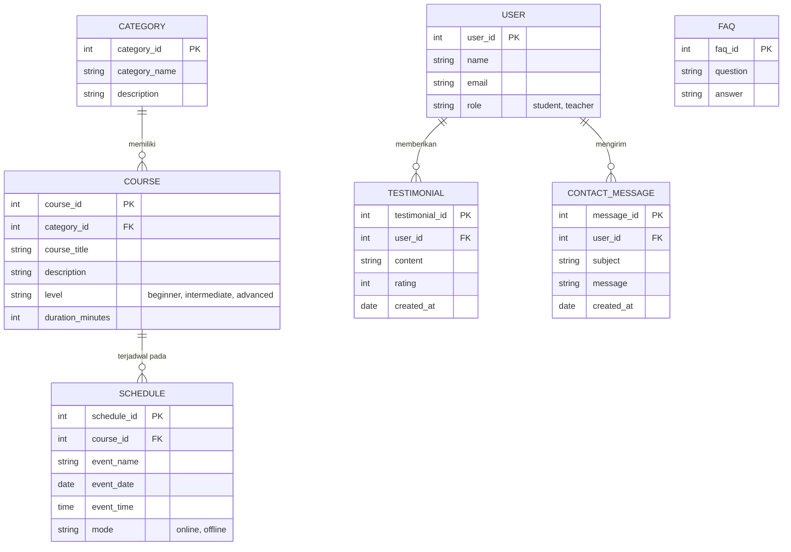

# Entity Relationship Diagram (ERD) Konseptual

Meskipun EduTech adalah website statis, ERD konseptual ini disertakan dalam proposal untuk menunjukkan **pemahaman arsitektur data** jika sistem ini nantinya dikembangkan menjadi platform dinamis (menggunakan *backend*).

## 1. Visualisasi ERD

## 2. Kamus Data (Data Dictionary)
| Entitas | Deskripsi | Atribut Kunci (Primary Key) |
| :--- | :--- | :--- |
| **User** | Data entitas pengguna (siswa/guru) yang berinteraksi. | `user_id` |
| **Category** | Pengelompokan bidang ilmu atau mata pelajaran. | `category_id` |
| **Course** | Data spesifik mengenai kelas atau modul materi. | `course_id` |
| **Schedule** | Jadwal spesifik untuk pelaksanaan *course* tertentu. | `schedule_id` |
| **Testimonial**| Ulasan dan penilaian (rating) yang diberikan oleh *User*. | `testimonial_id` |
| **FAQ** | Kumpulan pertanyaan dan jawaban statis. | `faq_id` |
| **Contact_Message**| Pesan dari form kontak. | `message_id` |
